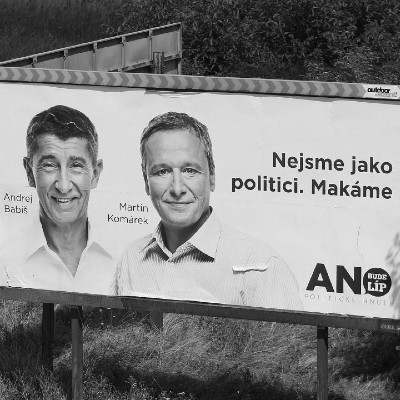

# Bilance vybraných významných **předvolebních slibů** hnutí ANO z 2017

- jednodušší daně - <i className="red">nesplněno</i>
- 170km nových dálnic - <i className="red">nesplněno</i>
- zeštíhlení byrokracie - <i className="red">nesplněno</i>
- elektronická státní správa - <i className="red">nesplněno</i>
- agentura pro sport - <i className="green">splněno</i>
- navýšení peněz na obranu - <i className="red">nesplněno</i>
- zrušení náhrad poslancům - <i className="red">nesplněno</i>
- jednokolové senátní volby - <i className="red">nesplněno</i>
- snížení nákladů ministerstev - <i className="red">nesplněno</i>
- snížení některých DPH - <i className="green">splněno</i>
- vyrovnaný rozpočet - <i className="red">nesplněno</i>
- stabilizace státního dluhu - <i className="red">nesplněno</i>
- podpora rodinných firem - <i className="red">nesplněno</i>
- podpora podnikání na venkově - <i className="red">nesplněno</i>
- zákon o liniových stavbách - <i className="green">splněno</i>

