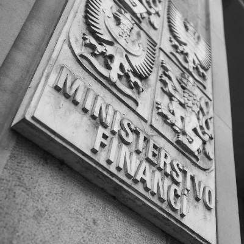

# Nenechme se uplatit penězi, kterými **ANO zadlužuje generace** našich potomků!

[Veřejný dluh Česka](https://www.verejnydluh.cz/) stoupá **2. nejrychlejším tempem v EU**, v současnosti dosahuje 227 tisíc Kč na každého obyvatele, včetně právě narozených dětí.

Přitom ještě předloni to bylo o 75 tisíc Kč na obyvatele méně.

Ministryně financí **Schillerová vědomě lže**, když tvrdí, že se nemusíme obávat.

Současným tempem zadlužování totiž dosáhneme **dluhové brzdy** (dluh ve výši 55% HDP) už v roce 2024.

Poté bude následovat skokové **zvýšení daní a masivní propouštění** ve státní správě, které povede k celkovému snížení životní úrovně.

