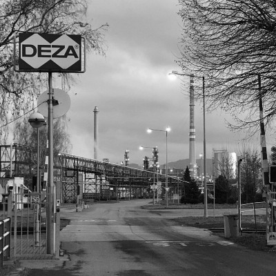

# **Česko kleslo** za vlády hnutí ANO v žebříčku kvality života

I přes populistické a nesystémové předvolební rozdávání, **reálná kvalita života v ČR** v posledních letech **klesá**.

**Ceny potravin, energií i bydlení** rychle **rostou**, průměrné důchody v poměru k průměrné mzdě klesají.

**Hnutí ANO nebude** aktivně přispívat ke zlepšení životního prostředí ani kvality potravin, neboť by šlo **proti zájmům Agrofertu**.

Pro příklad - viníka **otravy řeky Bečvy** se s jistotou vypátrat nepodaří, protože ANO hned po volbách dosadilo své lidi do čela České Inspekce Životního Prostředí.

Jak dokázal přírodovědec Hruška svým [pokusem přímo na místě](https://ekolist.cz/cz/publicistika/nazory-a-komentare/jakubn-hruska-ryby-v-becve-nemohly-otravit-toxiny-z-roznovskeho-kanalu), **Rožnovský kanál**, který hned na začátku označil ministr Brabec (bývalý zaměstnanec Babišovy Lovochemie) **na vině nebyl**.

Za zmínku rovněž stojí, že v den otravy Bečvy se stala [provozní havárie **v chemičce DEZA**](https://denikreferendum.cz/clanek/32010-odhaleno-v-den-otravy-becvy-se-v-deze-stala-havarie-proc-zustala-utajena) z holdingu Agrofert.

Tato chemička stojí mnohem blíže místu **úhynu ryb**. Náhoda? To už se s jistotou bohužel nedozvíme.

